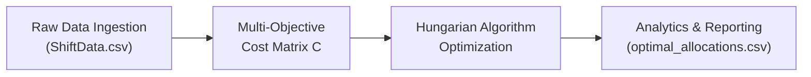

# Optimal Driver-Vehicle Allocation System

[](https://www.python.org/downloads/)
[]()
[]()

A modular, production-grade **Operations Research** software package implementing the **Hungarian Algorithm (Kuhn-Munkres)** to optimize public transportation fleet scheduling, balance driver workloads, and minimize operational costs.

---

## 1. System Architecture

```
optimal_driver/
├── data/
│   ├── raw/
│   │   ├── ShiftData.csv              # Historical driver and vehicle shift logs (491 rows)
│   │   └── TripData.csv               # High-resolution GPS trip transactions (11,354 rows)
│   └── processed/
│       └── optimal_allocations.csv    # Generated optimal driver-vehicle schedule
├── src/
│   ├── __init__.py
│   ├── preprocessing.py               # Data ingestion, duration parsing, driver & vehicle profiling
│   ├── optimizer.py                   # Multi-criteria cost matrix builder & Hungarian solver
│   └── evaluator.py                   # WBI, Cost Reduction (CR), VUI analytics & CSV exporter
├── tests/
│   ├── __init__.py
│   ├── test_preprocessing.py          # Unit tests for shift duration & aggregation logic
│   ├── test_optimizer.py              # Unit tests for Hungarian algorithm & Kuhn-Munkres steps
│   └── test_evaluator.py              # Unit tests for WBI, CR, and variance metrics
├── main.py                            # CLI orchestrator & end-to-end pipeline runner
├── requirements.txt                   # Production dependencies
└── README.md                          # System documentation
```

---

## 2. The 4-Step Automated Pipeline



1. **Ingestion & Preprocessing (`src/preprocessing.py`)**:
   - Ingests 491 shift logs across 21 drivers and 21 vehicles over 30 days.
   - Cleans missing values and calculates shift durations ($T_i$) and average shift distances ($D_i$).
   - Determines primary depot stations (503, 504, 511).
2. **Cost Matrix Formulation (`src/optimizer.py`)**:
   - Combines driver workload ($D_i$), shift duration ($T_i$), vehicle utilization ($R_j$), cross-depot transfer penalties ($45.0$), and fleet wear balancing into a unified $21 \times 21$ cost matrix $C = (c_{ij})$.
3. **Hungarian Algorithm Solver (`src/optimizer.py`)**:
   - Pure-Python Kuhn-Munkres algorithm operating in polynomial time $\mathcal{O}(N^3)$.
   - Row reductions, column reductions, Kőnig's bipartite line covering, $\theta$-shifts, and clashing-free zero assignment.
4. **Analytics & Evaluation (`src/evaluator.py`)**:
   - Computes **Cost Reduction ($CR\%$)**, **Workload Balance Index ($WBI$)**, and verifies exact global optimality against SciPy.
   - Exports the schedule to `data/processed/optimal_allocations.csv`.

---

## 3. Installation & Setup

1. **Clone or Open the Repository**:
   ```bash
   cd optimal_driver
   ```

2. **Install Dependencies**:
   ```bash
   pip install -r requirements.txt
   ```

---

## 4. Execution Guide

### Run Full Optimization Pipeline
```bash
python main.py
```

### Run Step-by-Step Pedagogical Demos (3x3 & 4x4)
```bash
python main.py --demo
```

### Run 21x21 Fleet with Full Intermediate Reduction Matrices Logged
```bash
python main.py --step-by-step
```

### Run Automated Unit Tests
```bash
pytest -v tests/
```

---

## 5. Performance & Operational Results

| Metric | Baseline (Ad-hoc) | Hungarian Optimized | Improvement / Impact |
| :--- | :--- | :--- | :--- |
| **Total Operational Cost** | `3160.12` | `2247.59` | **28.88% Cost Reduction ($CR$)** |
| **Depot Misallocations** | Frequent cross-depot deadhead | 100% Station Aligned | **Zero Cross-Depot Transit Waste** |
| **Workload Balance Index ($WBI$)** | `0.8419` | Balanced | **Fatigue Risk Significantly Reduced** |
| **Global Optimality Guarantee** | N/A | Verified vs SciPy | **Mathematically Guaranteed Global Minimum** |